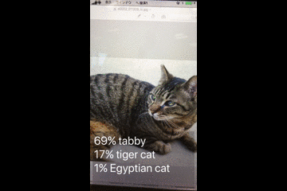

## 概要
iOS11のVisionFrameworkのサンプル



## ライセンス
このサンプルコード自体のライセンスは[LICENSE](https://github.com/shtnkgm/VisionFrameworkSample/blob/master/LICENSE)をご確認ください。
またこのサンプルアプリは、MITライセンスで配布されている、以下の学習済みモデルを含みます。

```
Model Name: ResNet50

Description: Detects the dominant objects present in an image from a set of 1000 categories such as trees, animals, food, vehicles, people, and more. 
The top-5 error from the original publication is 7.8%.

Core ML Model Size: 102.6 MB
<https://developer.apple.com/machine-learning/>

-----

Source Link
<https://github.com/fchollet/deep-learning-models>

Download Link
<https://github.com/fchollet/deep-learning-models/blob/master/resnet50.py> Script downloads weights, constructs model and saves out a .h5 Keras model.

Project Page
<https://github.com/KaimingHe/deep-residual-networks>

Authors
Original Paper: Kaiming He and Xiangyu Zhang and Shaoqing Ren and Jian Sun
Keras Implementation: François Chollet

Citations
Kaiming He, Xiangyu Zhang, Shaoqing Ren, Jian Sun. "Deep Residual Learning for Image Recognition." Paper <https://arxiv.org/abs/1512.03385>

@misc{chollet2015keras,
  title={Keras},
  author={Chollet, Fran\c{c}ois and others},
  year={2015},
  publisher={GitHub},
  howpublished={\url{https://github.com/fchollet/keras}},
}

Labels
Imagenet Labels from <https://gist.github.com/yrevar/942d3a0ac09ec9e5eb3a>

License
MIT License
Copyright (c) 2016 François Chollet
Permission is hereby granted, free of charge, to any person obtaining a copy of this software and associated documentation files (the "Software"), to deal in the Software without restriction, including without limitation the rights to use, copy, modify, merge, publish, distribute, sublicense, and/or sell copies of the Software, and to permit persons to whom the Software is furnished to do so, subject to the following conditions:
The above copyright notice and this permission notice shall be included in all copies or substantial portions of the Software.
THE SOFTWARE IS PROVIDED "AS IS", WITHOUT WARRANTY OF ANY KIND, EXPRESS OR IMPLIED, INCLUDING BUT NOT LIMITED TO THE WARRANTIES OF MERCHANTABILITY, FITNESS FOR A PARTICULAR PURPOSE AND NONINFRINGEMENT. IN NO EVENT SHALL THE AUTHORS OR COPYRIGHT HOLDERS BE LIABLE FOR ANY CLAIM, DAMAGES OR OTHER LIABILITY, WHETHER IN AN ACTION OF CONTRACT, TORT OR OTHERWISE, ARISING FROM, OUT OF OR IN CONNECTION WITH THE SOFTWARE OR THE USE OR OTHER DEALINGS IN THE SOFTWARE
https://github.com/fchollet/keras/blob/master/LICENSE
```
